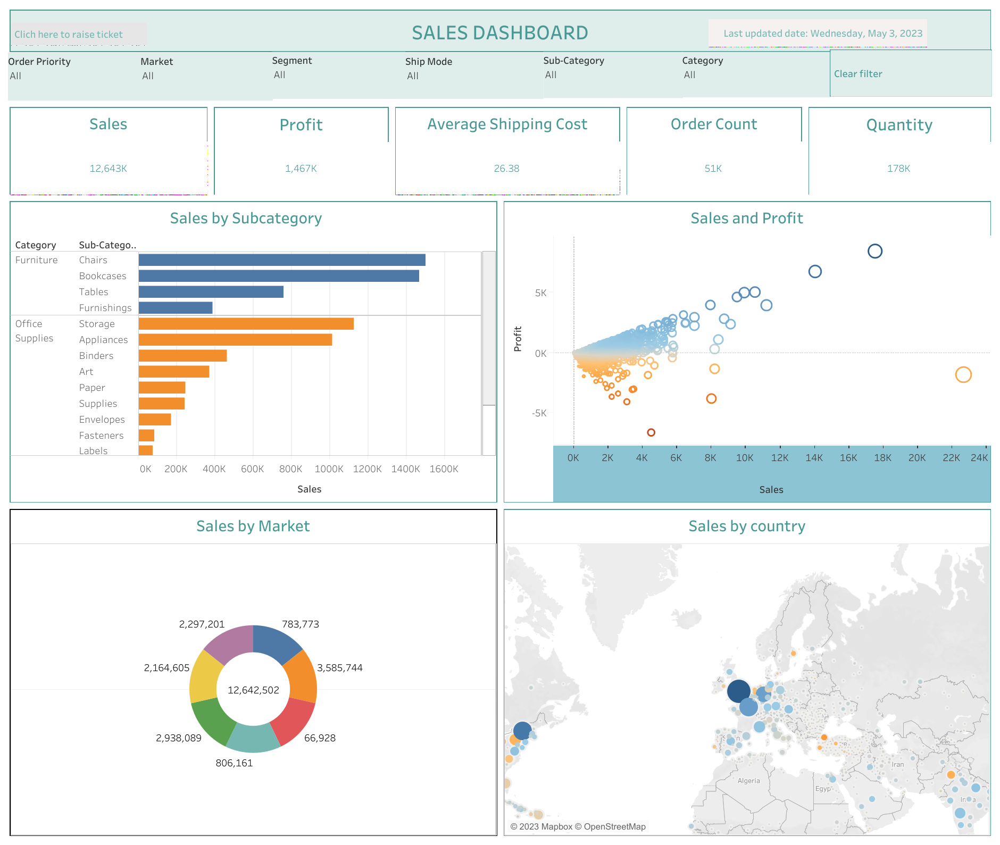

# Sales_Analysis

## Introduction
This is a Tableau project on global superstore aimed at tracking core business KPIs such as sales, average shipping cost, profit and revenue. The objective is to create an interactive dashboard to analyze the sales dataset and discover relevant insights.

## Dataset
From [kaggle](https://www.kaggle.com/datasets/shekpaul/global-superstore)

## Visualization

See the [Interactive Dashboard](https://public.tableau.com/app/profile/tableau7010) live on my Tableau Public Profile

